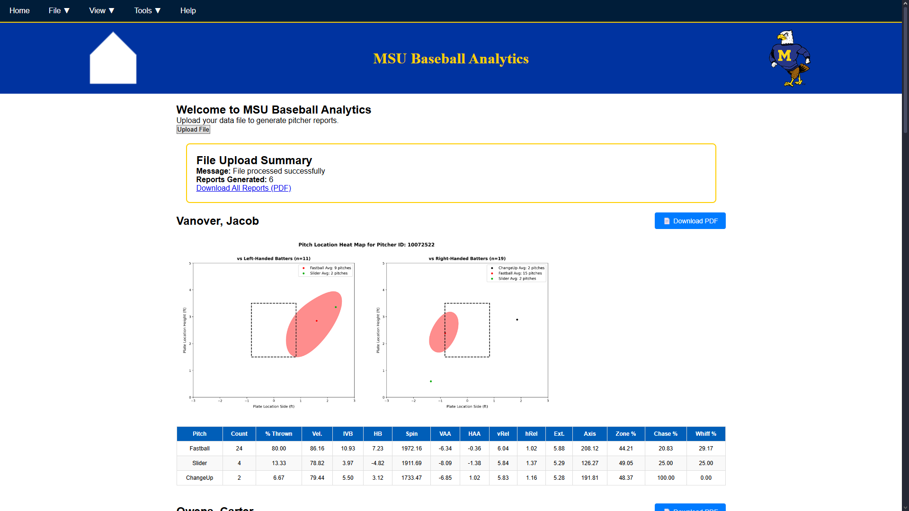

# MSU Baseball Pitcher Report Generator

A Flask-based web application that generates comprehensive pitcher performance reports from TrackMan baseball data files. The application creates visual heat maps and statistical tables for each pitcher, with options to view online or download as PDF.

## Features

- 📊 **Interactive Heat Maps**: Visualize pitch locations by batter handedness
- 📈 **Statistical Tables**: Detailed performance metrics for each pitcher
- 📄 **PDF Export**: Download individual or merged PDF reports
- 🎨 **Modern UI**: Clean, responsive interface with MSU branding
- ⚡ **Batch Processing**: Process multiple pitchers from a single upload

## Screenshots



## Prerequisites

- Python 3.8 or higher
- pip (Python package installer)

## Installation

### 1. Clone or Download the Repository
```bash
git clone https://github.com/yourusername/pitcher-reports.git
cd pitcher-reports
```

Or download and extract the ZIP file.

### 2. Create a Virtual Environment (Recommended)

**Windows:**
```bash
python -m venv venv
venv\Scripts\activate
```

**Mac/Linux:**
```bash
python3 -m venv venv
source venv/bin/activate
```

### 3. Install Required Packages
```bash
pip install -r requirements.txt
```

If you don't have a `requirements.txt` file, install packages individually:
```bash
pip install flask flask-cors pandas openpyxl matplotlib seaborn xhtml2pdf PyPDF2 pillow
```

### 4. Verify Directory Structure

Ensure your project structure looks like this:
```
pitcher_reports/
├── main.py
├── app/
│   ├── input/              (created automatically)
│   ├── services/
│   │   ├── report.py
│   │   └── pdf_generator.py
│   ├── static/
│   │   ├── output/         (created automatically)
│   │   ├── pdfs/           (created automatically)
│   │   ├── scripts.js
│   │   ├── style.css
│   |   └── resources/
|   │       ├── favicon.ico
|   │       └── strutting_eagle.png
│   └── templates/
│       ├── index.html
│       └── report.html
├── requirements.txt
└── README.md
```

## Usage

### 1. Start the Application
```bash
python main.py
```

You should see output like:
```
 * Running on http://127.0.0.1:5000
 * Restarting with stat
```

### 2. Open in Browser

Navigate to: `http://127.0.0.1:5000` or `http://localhost:5000`

### 3. Upload Data File

1. Click the **"Upload File"** button
2. Select a CSV or Excel file (.csv, .xlsx, .xls) containing pitcher data (Have not tested on .csv or .xls file types yet!)
3. Wait for processing to complete

### 4. View and Download Reports

- **View Online**: Reports appear automatically after upload
- **Download Individual PDFs**: Click the "Download PDF" button on each report
- **Download All**: Use File → Download in the navbar to get all reports in one PDF

## Required Data Format

The application is configured to take as input a .xlsx file in the format of a TrackMan baseball report. Contact for additional details.

### Example Data Structure
```xlsx
Pitcher,PitcherId,TaggedPitchType,PlateLocHeight,PlateLocSide,BatterSide,...
John Doe,10072522,Fastball,2.5,0.2,Right,...
John Doe,10072522,Curveball,1.8,-0.5,Left,...
Jane Smith,10284558,Fastball,2.7,0.1,Right,...
```

## Troubleshooting

### Port Already in Use

If port 5000 is already in use, modify `main.py`:
```python
if __name__ == '__main__':
    app.run(debug=True, port=5001)  # Change to different port
```

### Module Not Found Errors

Make sure you're in the virtual environment and all packages are installed:
```bash
pip install --upgrade -r requirements.txt
```

### Permission Errors

Ensure the application has write permissions for:
- `app/input/`
- `app/static/output/`
- `app/static/pdfs/`

### Images Not Loading

Verify that image files exist in `app/resources/`:
- `favicon.ico`
- `strutting_eagle.png`

## Development

### Running in Debug Mode

The application runs in debug mode by default. Changes to Python files will auto-reload the server.

### Modifying Styling

Edit `app/static/style.css` to customize the appearance.

### Changing Heat Map Settings

Modify parameters in `app/services/report.py`:
```python
def pitch_heat_map_by_batter_side(path, pitcher_id, threshold=0.1):
    # Adjust threshold, colors, figure size, etc.
```

## File Structure Explained

- **`main.py`** - Flask application entry point
- **`app/services/report.py`** - Data processing and heat map generation
- **`app/services/pdf_generator.py`** - PDF creation and merging
- **`app/static/scripts.js`** - Frontend JavaScript functionality
- **`app/static/style.css`** - Application styling
- **`app/templates/`** - HTML templates

## Dependencies

- **Flask** - Web framework
- **Flask-CORS** - Cross-origin resource sharing
- **pandas** - Data manipulation
- **openpyxl** - Excel file support
- **matplotlib** - Plotting library
- **seaborn** - Statistical visualization
- **xhtml2pdf** - HTML to PDF conversion
- **PyPDF2** - PDF manipulation
- **Pillow** - Image processing
- May be others

## Creating requirements.txt

To generate a requirements file:
```bash
pip freeze > requirements.txt
```

## Contributing

1. Fork the repository
2. Create a feature branch (`git checkout -b feature/AmazingFeature`)
3. Commit your changes (`git commit -m 'Add some AmazingFeature'`)
4. Push to the branch (`git push origin feature/AmazingFeature`)
5. Open a Pull Request

## License

This project is source-available for non-commercial use.
Commercial licensing is available upon request.

University logos, seals, and trademarks included in this repository are the property of Morehead State University and are not licensed for reuse or redistribution. They are included solely for use by Morehead State University and its constituents.

## Contact

Thomas Eubank - [thomas.eubank516@gmail.com](mailto:thomas.eubank516@gmail.com)

Project Link: [https://github.com/WarmFreezer/pitcher_reports](https://github.com/WarmFreezer/pitcher_reports)

## Acknowledgments

- MSU Baseball Analytics Team
- Prof. Asim Chaudhry

## Support

For issues and questions:
1. Check the [Troubleshooting](#troubleshooting) section
2. Open an issue on GitHub
3. Contact the development team (me)

---

**Version:** 1.0.0  
**Last Updated:** January 2026